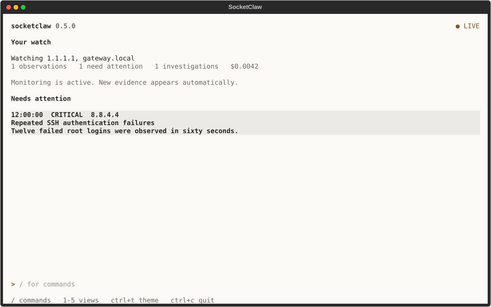

# SocketClaw

SocketClaw is a local-first terminal security operations cockpit. It watches
configured hosts and logs, explains why each observation is important, stores
the evidence in SQLite, and uses GPT-5.6 Luna directly through the OpenAI
Platform when deeper incident analysis is requested.



## What it does

- Runs cross-platform ping checks, bounded TCP port scans, and rotation-aware
  log watchers in one resilient process.
- Scores every event locally with visible detection signals; monitoring keeps
  working without an API key or OpenAI connectivity.
- Presents a keyboard-first Textual interface for posture, events, hosts,
  investigations, and settings.
- Persists events and model operations in a local SQLite database. This includes
  estimated costs, failures, and response proposals.
- Exports redacted Markdown or JSON incident records.
- Connects only to `https://api.openai.com/v1` for AI investigation. No
  alternate model-provider route or fallback exists.

## Requirements

- Python 3.11 or newer
- A terminal with color support
- The optional system `ping` command for reachability checks. Other probes keep
  working when it is unavailable.
- An optional OpenAI API key for AI investigations. Monitoring works without
  one.

## Install

From a checkout, the recommended isolated installation is:

```bash
uv tool install ./src
```

Or with pipx:

```bash
pipx install ./src
```

For development:

```bash
cd src
uv sync --dev
uv run socketclaw
```

## First run

Launch SocketClaw:

```bash
socketclaw
```

The four-step onboarding flow:

1. explains the local file boundary;
2. optionally validates an OpenAI key and Luna access without generating
   tokens, or continues offline;
3. configures initial targets and intervals;
4. starts the local monitor.

The API key field is masked. When supplied, the key is stored as inert data in
`~/.socketclaw/.env`; the file is never sourced as shell code. On POSIX
systems, SocketClaw enforces mode `0700` on its home and `0600` on managed
configuration, credential, database, and export files. SQLite WAL/SHM sidecars
remain protected by the non-traversable `0700` home directory. On Windows, the
directory inherits the account ACL of the user profile.
Offline onboarding persists normally. AI investigations remain unavailable
until a validated key is added from Settings.

## OpenAI model policy

| Model | OpenAI model ID | Reasoning effort |
|---|---|---|
| GPT-5.6 Luna | `gpt-5.6-luna` | `medium` for medium and lower events, `high` for high and critical events |

The model cannot be changed in configuration or the UI. Requests use the
OpenAI Responses API with structured outputs. A failed request becomes a
durable, retryable investigation failure instead of falling back.

## Keyboard reference

| Key | Action |
|---|---|
| `1`–`5` | Open Overview, Events, Hosts, Investigations, or Settings |
| `Space` | Pause or resume scheduled monitoring |
| `C` / `A` | Show critical events / clear event filters |
| `Enter` / `Esc` | Open selected event or investigation detail / return to the list |
| `L` | Open Hosts / Logs to manage sources and inspect collection progress |
| `H` | Inspect collection health, stale probes, and scheduling delays |
| `I` | Investigate the selected event |
| `E` | Export the selected observation as Markdown |
| `R` | Run the context action (host ping, log test read, or investigation retry) |
| `Ctrl+P` | Open the Textual command palette |
| `?` | Show keyboard help |
| `Q` | Stop monitoring and quit cleanly |

## Response safety

Model output can create a response proposal, but it cannot directly change the
machine:

- a proposal records the exact action, target, reason, and reversibility;
- approval and rejection are explicit, durable state transitions;
- approval requires a confirmation modal;
- unsafe address classes such as loopback and multicast are rejected as block
  targets;
- configured IP watch targets are also rejected;
- this release does **not** ship a firewall mutation adapter. “Approved” means
  reviewed and recorded, not executed on the host.

Every proposal stays in the explicit review workflow. Operators choose whether
to open a review-to-end confirmation step for approval or rejection.

## Local files

The default application home is `~/.socketclaw`. Override it with
`SOCKETCLAW_HOME` for testing or an alternate profile.

```text
~/.socketclaw/
├── .env                 # optional OpenAI key, private file
├── .instance.lock       # private single-process ownership lock
├── config.toml          # validated non-secret settings, private file
├── socketclaw.db        # events, investigations, proposals, runs
├── backups/             # verified private snapshots before schema migration
└── exports/             # redacted incident Markdown and JSON
```

Only one SocketClaw TUI may own an application home at a time. A second launch
is rejected before it can recover or modify work owned by the running process.

Configuration and export writes use a temporary file, `fsync`, and atomic
replace. SocketClaw never prints the configured key in doctor output, UI
notifications, exports, or live-test evidence.

Automatic exports use POSIX directory handles so a replaced export directory
cannot redirect incident data. On platforms without those handles, automatic
exports fail closed; use `socketclaw export --output PATH` with a path you
selected explicitly.

## Commands

```bash
socketclaw                       # launch the TUI
socketclaw doctor                # launch-readiness diagnostics
socketclaw config path           # effective application home
socketclaw db status             # read-only schema and integrity check
socketclaw db migrate            # back up and upgrade storage under the writer lock
socketclaw export --format markdown
socketclaw export --format json --output incident.json
socketclaw export --event EVENT_UUID
socketclaw version
```

`doctor` treats malformed configuration and unusable SQLite storage as launch
blockers. Missing optional system commands are warnings so the rest of the
cockpit remains usable.

### Detection rules

Open **Settings > Detection rules**, or choose **Detection rules** in the command
palette. The balanced preset has editable numeric thresholds and score
contributions. The editor labels seconds, percentages, and counts explicitly.
Counts include the current observation. Each signal contributes 0-100 points;
the combined score is capped at 100. Loss thresholds must satisfy degraded < high
< 100 percent. No scripts or custom regular expressions run from rule settings.

Rules are stored in `[rules]` and `[rules.points]` in `config.toml`. The default
correlation window is 300 seconds. Authentication bursts require six failures,
sustained high loss requires four observations, and firewall bursts require ten
denials. A burst of new ports requires five newly opened ports in one scan.

New observations use the batch's fixed collection time for their correlation
window, regardless of the source's reported clock or arrival order. Retrying a
stored candidate keeps that time. Only deduplicated observations from the same
rule version and correlation key contribute. Window endpoints are inclusive.

The first observation using a changed policy records an immutable rule version
with its settings, engine/parser versions, and SHA-256 fingerprint. Subsequent
observations reference it; restart resumes its durable window. Changing the
policy starts a separate window, including when reverting to an earlier policy.
Past observations keep their original score and version. Historical records
without rule provenance remain unknown. Exported event metadata includes the
rule version, and Markdown reports show it explicitly.

### Incident desk

Choose **Incidents** in Events or **Incident desk** from the command palette.
Needs attention shows open and acknowledged incidents. Resolved and All provide
access to closed history. The list shows severity, source, and observation counts;
a wide terminal also shows the selected incident beside the list.

Press Enter to read its activity, occurrences, and notes. Acknowledge, Resolve,
and Reopen record a reason. Notes remain in the history. Measured recovery is
recorded separately from operator resolution, and a recurrence can open a new
occurrence while retaining earlier notes. Press Esc to return to the list.

Open **Observations** from an incident to inspect its exact linked evidence and
return with Esc. **Export .md** includes the current state, complete activity,
occurrences, notes, and related observations. The CLI also accepts
`socketclaw export --incident UUID --format json`.

**Exceptions** opens maintenance rules. Create an exception with a scope,
reason, and duration of up to 30 days, or end it early with a reason. Filled
scope fields must all match. Original observations and scores remain available;
applicable decisions appear in observation details and exports.

Use R or Refresh to load new state. Previous and Next traverse 100 incidents at
a time; the search field filters the current page. Existing observations retain
their original scores. Incident history starts with observations ingested after
the upgrade; historical observations are not retroactively grouped.

### Storage upgrades and collector recovery

Launching the TUI or running `db migrate` upgrades a version 1, 2, or 3 database to
version 4. Before changing its schema, SocketClaw creates a verified SQLite
snapshot, including committed WAL data, in `backups/`. Its JSON manifest records
the schema version and SHA-256 digest. These private backups include local
evidence but do not include the API key file. A failed migration rolls back and
reports the recovery snapshot location. Keep that snapshot until you have
verified the upgraded data. `doctor`, `db status`, and `export` never migrate
storage; they report when an explicit upgrade is needed.

Historical observation timestamps remain unchanged. Unknown historical
collection quality and missing ingestion timestamps remain unknown. A
reconstructed ordering is marked separately from the actual ingestion sequence
assigned to new observations.

The first attachment to an existing log starts at its current end. Subsequent
runs resume the last committed byte position. Matching observations and the
new position commit together, including polls with no pattern matches. Failed
writes retry the candidate batch without advancing the cursor. Renamed sibling
files such as `auth.log.1` are drained when their file identity and fingerprints
match. The sibling search examines at most 256 directory entries. Deleted,
overwritten, or otherwise unavailable generations leave a recovery gap; the
number of lost bytes may be unknown. Press `L` to inspect committed progress.

Hosts has Targets and Logs tabs. The Logs tab adds or removes watched paths and
shows each source's read state and backlog. Enter opens its full progress and
error detail. Removing a source keeps its stored observations and checkpoint;
adding it again resumes that checkpoint. Test read, also available with `R`,
reads at most 64 KiB from the file tail and shows at most 20 matching complete
lines. It does not save observations or advance the collector. Links, devices,
and directories are not accepted as preview files.

The log parser recognizes OpenSSH failed authentication messages and PAM
`pam_unix` failures. It also reads explicit `SRC` and `DST` fields in Linux
firewall denial messages, including UFW BLOCK. The simple
`authentication failure from ADDRESS` fixture format is supported. Source and
destination addresses are validated separately; invalid or duplicate source
fields remain unknown. Other formats retain keyword detection with no inferred
source IP. The first IP mentioned in an arbitrary message is not treated as its
actor.

An ISO timestamp with an explicit UTC offset or `Z` becomes `source_at`.
Yearless syslog timestamps and timestamps without a timezone remain unknown;
SocketClaw does not invent their year or timezone. Evidence records the parser
version and parsing quality. Collection and ingestion timestamps remain separate
from the source's reported time, and existing observations are not rewritten.

Port baselines also commit with their observations and survive restarts.
Only confirmed ports in the common watch scope count as changes. Set
`port_baseline_ttl` in `config.toml` to the comparison lifetime in seconds
(default `86400`, allowed range `1` to `2592000`). Expired values remain reference
evidence and do not produce a new-open or new-close claim. Unknown scans do not
refresh a port's last confirmation time.

Network results are retained in memory for storage retries, with one pending
batch per scheduled job. A job waits for that batch to commit before collecting
again. A forced process exit can still lose uncommitted network measurements;
these cannot be replayed like file logs.

### Collection health and scheduling

Press `H`, or choose Health from the command palette, to inspect each scheduled
probe. Enter opens its last attempt, last successful collection, and last
observation. The detail also shows its next scheduled start, delay, and skipped
ticks. Health describes measurement quality: a measured 100% ping loss is a
successful collection of an unreachable result. Missing logs, unreadable files,
and unclassified probe results remain degraded even when no exception escapes
the collector.

Probe health and meaningful state transitions are saved locally. Repeated
identical exceptions increase the error count without creating an event on
every poll. Stale means no successful collection within three configured
intervals, with a minimum grace of ten seconds. Replaying an old pending batch
does not make its measurement time fresh. An interrupted attempt is identified
on restart; inspect committed observations before inferring what was lost.

Intervals are targets between execution starts, measured with a monotonic
clock. Startup uses a stable spread of up to 10% of the interval, capped at
100 ms. At most eight collection operations run at once by default. An
overrunning operation skips elapsed ticks rather than overlapping itself.
Scheduled and manual work share the same lock for a target and probe.
Pausing prevents new scheduled starts while in-flight work finishes. Manual
diagnostics remain available while paused. Removing a scheduled job first
commits its retained measurement; a storage failure prevents that reconfiguration.

Health also reports pending batches and dropped UI notifications. A dropped
notification does not delete its stored observation. Complete notification-loss
resynchronization and investigation-queue metrics are still under development.

## Troubleshooting

**Onboarding says the key is invalid**

Confirm that the key is an OpenAI Platform key and has access to
`gpt-5.6-luna`. `socketclaw doctor` reports only whether a key is configured;
it never prints its value. You can continue onboarding offline and add a key
later from Settings.

**Ping is unavailable**

Run `socketclaw doctor`. Install the operating system `ping` command, or use the
TCP port scans and log monitoring meanwhile. Probe failures become system
events instead of stopping other jobs.

**The config file will not load**

Run `socketclaw config path`, inspect `config.toml`, and correct the first
validation error shown by `socketclaw doctor`. SocketClaw will not overwrite a
malformed file automatically.

**OpenAI returns 401, 402, 429, or an API error**

The investigation detail preserves a redacted, classified failure. Correct the
key or credit/rate-limit condition and use Retry. Local monitoring and history
remain available.

**The terminal is small**

SocketClaw supports an 80×24 compact layout. A wider terminal exposes more
detail columns and the secondary incident pane. Press Enter on an event or
investigation to open its full detail at any size, then Esc to return to the
same list position. Overview also opens its selected observation with Enter.

When you select an older event or open its detail, the Events list holds its
position while collection continues. The new-observation count shows pending
updates. Choose Live to refresh the list from storage.

Settings preserve unsaved fields when another workspace changes configuration.
If both edits touch the same field, Save shows the loaded, saved, and draft
values. Choose which version to keep before applying the overlapping change.

## Development and verification

From the repository root, enter the development project:

```bash
cd src
uv sync --dev
uv run pytest -q
uv run ruff format --check .
uv run ruff check .
uv run pyright
uv lock --check
uv export --frozen --no-hashes --no-dev --no-emit-project --output-file .audit-requirements.txt
uvx pip-audit --disable-pip --no-deps -r .audit-requirements.txt
uv build
```

From `src/`, regenerate the secret-checked TUI captures after intentional visual
changes:

```bash
uv run python scripts/capture_tui.py
```

Only `src/artifacts/tui/overview-120x36.svg`, used above, is tracked. Other
captures are generated on demand and ignored by Git. Visual regression
baselines remain in `src/tests/tui/snapshots/`. Generated live OpenAI evidence
is also local-only and ignored by Git.

Paid live OpenAI tests are opt-in. They use `OPENAI_API_KEY` when it is already
present in the environment, or they can read an explicit env-file path. The
file is parsed as data; it is not sourced:

```bash
SOCKETCLAW_LIVE_OPENAI=1 \
SOCKETCLAW_LIVE_ENV_FILE=/absolute/path/to/.env \
uv run pytest tests/live/test_openai_model.py -q
```

Run live tests from `src/`. Live evidence is redacted and written below
`src/artifacts/live-openai/`. The optional checkout `.env` stays at the
repository root and is ignored by Git.

## Repository layout

The root contains `README.md` and `.gitignore`, plus the private `.env`,
`AGNETS.md`, and `.agents/` entries. Git stores its internal data in `.git/`.
All development files live in `src/`, including the package source under
`src/src/socketclaw/`, tests, scripts, dependency metadata, and changelog.
See [the changelog](src/CHANGELOG.md) for release history.
