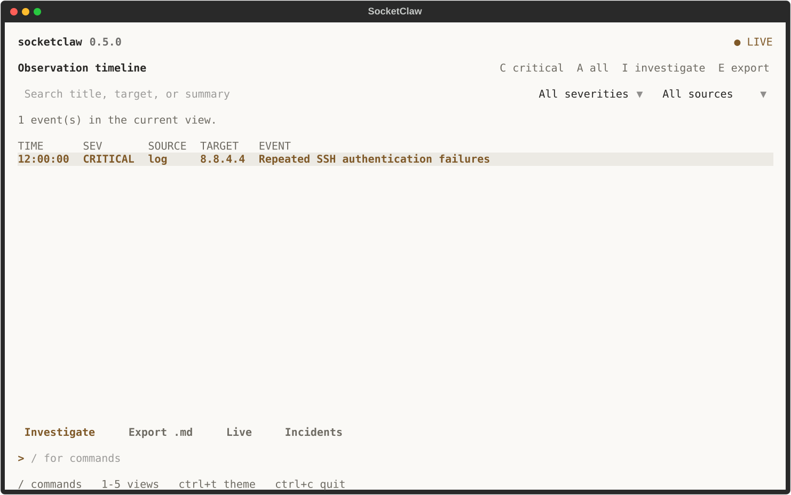
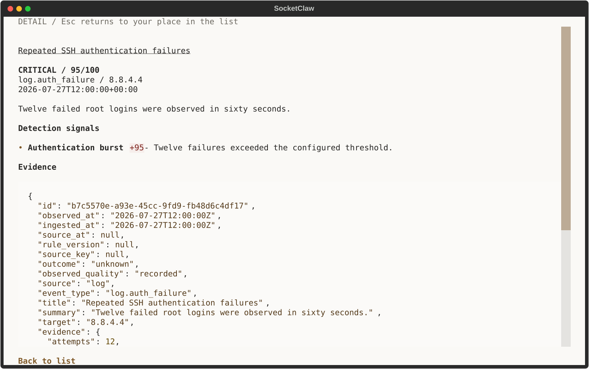
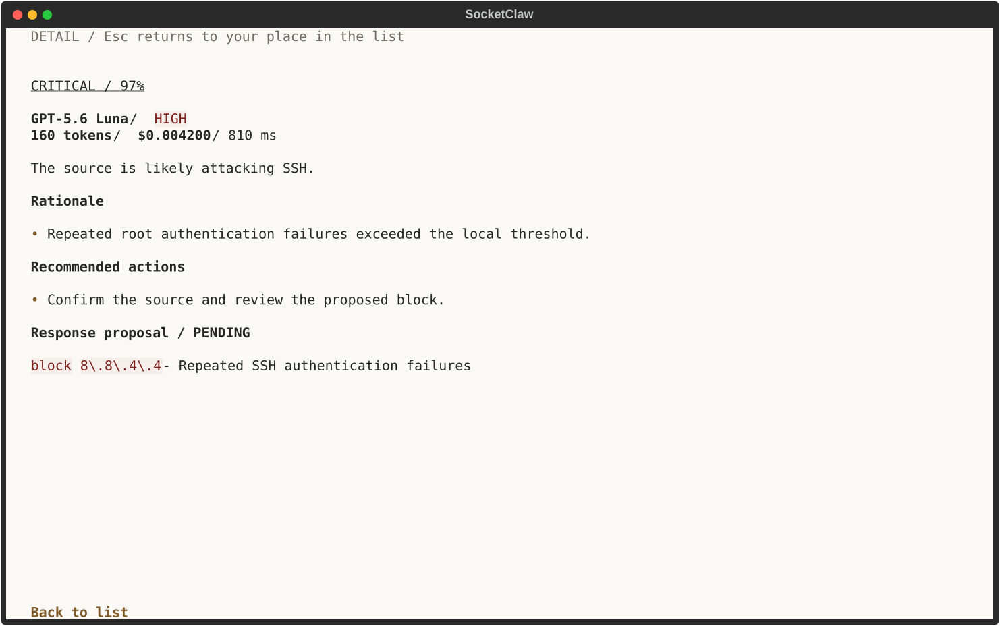
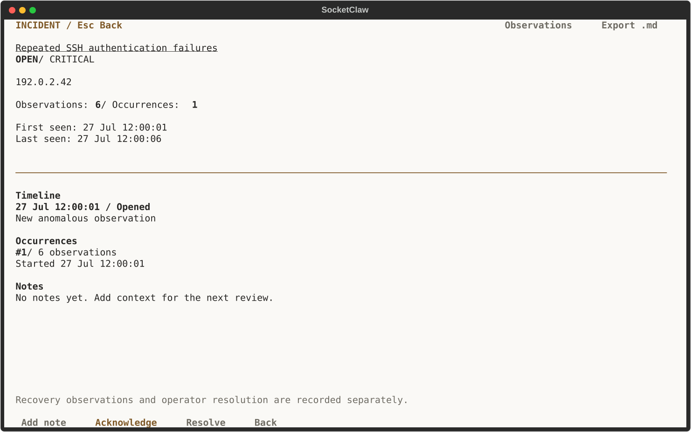
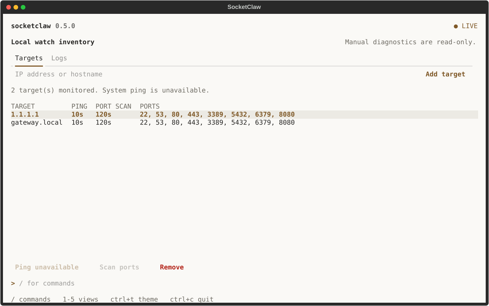
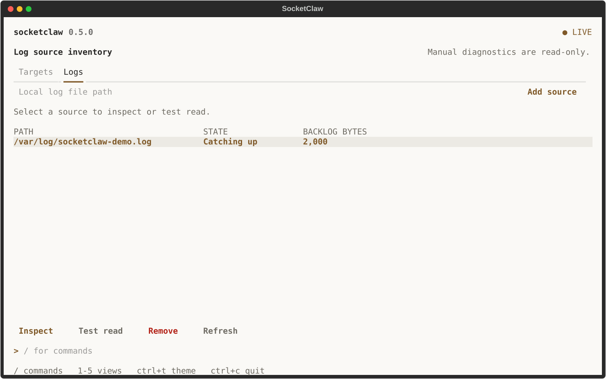
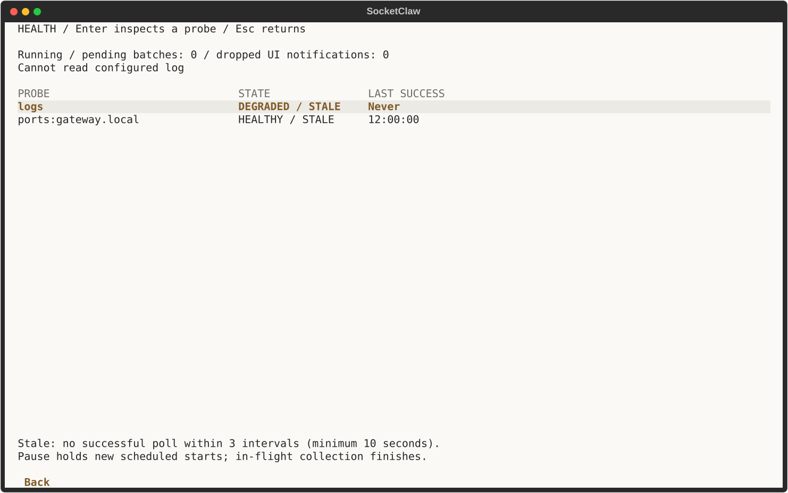
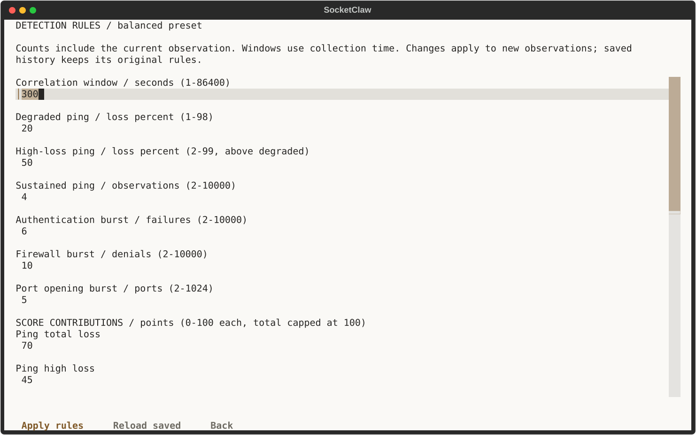

<h1 align="center">SOCKETCLAW</h1>

<p align="center">
  <strong>Watch the signal. Keep the evidence.</strong>
</p>

<p align="center">
  <em>A local-first security cockpit for hosts, ports, and logs.</em>
</p>

<p align="center">
  <a href="https://github.com/jbaehova/socketclaw/releases"></a>
  
  
  
</p>

<p align="center">
  
</p>

SocketClaw watches configured hosts, TCP ports, and log files from one terminal.
It scores observations locally, keeps the evidence in SQLite, and opens an
optional GPT-5.6 Luna investigation when you ask for deeper analysis.

```text
hosts + logs  ->  local detection  ->  SQLite evidence  ->  optional AI investigation  ->  review + export
```

## What It Does

- Runs cross-platform ping checks, bounded TCP port scans, and rotation-aware
  log watchers in one resilient process.
- Scores every event locally with visible detection signals; monitoring keeps
  working without an API key or OpenAI connectivity.
- Runs an inline terminal workspace with a plain activity feed and `/` commands.
  Forms adapt to narrow windows, and colors follow your terminal or a light/dark theme.
- Persists events and model operations in a local SQLite database. This includes
  estimated costs, failures, and response proposals.
- Exports redacted Markdown or JSON incident records.
- Connects only to `https://api.openai.com/v1` for AI investigation. No
  alternate model-provider route or fallback exists.

## Quick Start

On macOS, install the standalone release and launch the cockpit:

```bash
curl -fsSL https://raw.githubusercontent.com/jbaehova/SocketClaw/main/scripts/install.sh | sh
socketclaw
```

The first run guides you through targets and intervals. You can continue
offline and add an OpenAI key later if you want AI investigations. For Python
source installs and installer options, see the [installation details](docs/reference.md#install).

## In Action

Light-theme captures with sample local data.


















## Install from source

With Python 3.11 or newer, install from a checkout:

```bash
uv tool install ./src
```

You can also use `pipx install ./src`. The macOS standalone release includes
Python. See the [installation details](docs/reference.md#install) for installer
options and development setup.

## Everyday use

Type `/` to browse commands. The interface works in an 80×24 terminal and lets
you switch themes with `Ctrl+T`.

| Command | Action |
|---|---|
| `socketclaw doctor` | Check setup and local storage. |
| `socketclaw db status` | Inspect database status without changing it. |
| `socketclaw export --format markdown` | Export a redacted incident record. |
| `socketclaw version` | Show the installed version. |

Monitoring works offline. AI investigations require an OpenAI key, and response
proposals stay in an explicit review flow without changing the host firewall.

## Documentation

- [Full reference](docs/reference.md): installation, keyboard controls, detection
  rules, incident handling, storage recovery, and troubleshooting.
- [Development and verification](docs/reference.md#development-and-verification)
- [Changelog](src/CHANGELOG.md)
