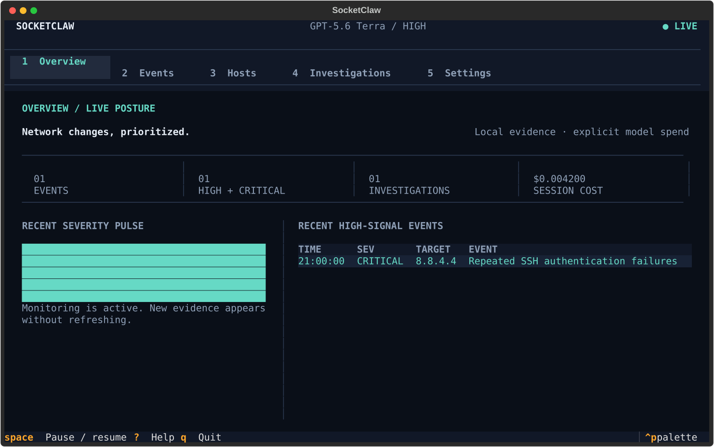

# SocketClaw

SocketClaw is a local-first terminal security operations cockpit. It watches
configured hosts and logs, explains why each observation is important, stores
the evidence in SQLite, and uses GPT-5.6 Luna directly through the OpenAI
Platform when deeper incident analysis is requested.



## What it does

- Runs cross-platform ping checks, bounded TCP port scans, and rotation-aware
  log watchers in one resilient process.
- Scores every event locally with visible detection signals; monitoring keeps
  working without an API key or network access.
- Presents a keyboard-first Textual interface for posture, events, hosts,
  investigations, and settings.
- Persists events and model operations in a local SQLite database. This includes
  estimated costs, failures, and response proposals.
- Exports redacted Markdown or JSON incident records.
- Connects only to `https://api.openai.com/v1` for AI investigation. No
  alternate model-provider route or fallback exists.

## Requirements

- Python 3.11 or newer
- A terminal with color support
- The system `ping` command for reachability checks
- An OpenAI API key for AI investigations (monitoring itself works without
  one)

## Install

From a checkout, the recommended isolated installation is:

```bash
uv tool install .
```

Or with pipx:

```bash
pipx install .
```

For development:

```bash
uv sync --dev
uv run socketclaw
```

## First run

Launch SocketClaw:

```bash
socketclaw
```

The four-step onboarding flow:

1. explains the local file boundary;
2. validates the OpenAI key and Luna access without generating tokens;
3. configures initial targets and intervals;
4. starts the local monitor.

The API key field is masked. The key is stored as inert data in
`~/.socketclaw/.env` with mode `0600`; the file is never sourced as shell code.

## OpenAI model policy

| Model | OpenAI model ID | Reasoning effort |
|---|---|---|
| GPT-5.6 Luna | `gpt-5.6-luna` | `medium` for medium events, `high` for high and critical events |

The model cannot be changed in configuration or the UI. Requests use the
OpenAI Responses API with structured outputs. A failed request becomes a
durable, retryable investigation failure instead of falling back.

## Keyboard reference

| Key | Action |
|---|---|
| `1`–`5` | Open Overview, Events, Hosts, Investigations, or Settings |
| `Space` | Pause or resume scheduled monitoring |
| `C` / `A` | Show critical events / clear event filters |
| `I` | Investigate the selected event |
| `E` | Export the selected incident as Markdown |
| `R` | Run the context action (host ping or investigation retry) |
| `Ctrl+P` | Open the Textual command palette |
| `?` | Show keyboard help |
| `Q` | Stop monitoring and quit cleanly |

## Response safety

The default response mode is `approval`. Model output can create a response
proposal, but it cannot directly change the machine:

- a proposal records the exact action, target, reason, and reversibility;
- simulation and approval are explicit, durable state transitions;
- approval requires a confirmation modal;
- loopback, multicast, unspecified, broadcast-like, and configured watch
  targets are rejected as block targets;
- this release does **not** ship a firewall mutation adapter. “Approved” means
  reviewed and recorded, not executed on the host.

`simulation` is the safest mode. `automatic` is visible as an advanced opt-in
configuration value, but it still cannot bypass the address safety policy or
invent a platform mutation adapter.

## Local files

The default application home is `~/.socketclaw`. Override it with
`SOCKETCLAW_HOME` for testing or an alternate profile.

```text
~/.socketclaw/
├── .env                 # OpenAI key, mode 0600
├── config.toml          # validated non-secret settings, mode 0600
├── socketclaw.db        # events, investigations, proposals, runs
└── exports/             # redacted incident Markdown and JSON
```

Configuration and export writes use a temporary file, `fsync`, and atomic
replace. SocketClaw never prints the configured key in doctor output, UI
notifications, exports, or live-test evidence.

## Commands

```bash
socketclaw                       # launch the TUI
socketclaw doctor                # launch-readiness diagnostics
socketclaw config path           # effective application home
socketclaw export --format markdown
socketclaw export --format json --output incident.json
socketclaw export --event EVENT_UUID
socketclaw version
```

`doctor` treats malformed configuration and unusable SQLite storage as launch
blockers. Missing optional system commands are warnings so the rest of the
cockpit remains usable.

## Troubleshooting

**Onboarding says the key is invalid**

Confirm that the key is an OpenAI Platform key and has access to
`gpt-5.6-luna`. `socketclaw doctor` reports only whether a key is configured;
it never prints its value.

**Ping or traceroute is unavailable**

Run `socketclaw doctor`. Install the operating system networking tools, or use
the port and log views meanwhile. Probe failures become system events instead
of stopping other jobs.

**The config file will not load**

Run `socketclaw config path`, inspect `config.toml`, and correct the first
validation error shown by `socketclaw doctor`. SocketClaw will not overwrite a
malformed file automatically.

**OpenAI returns 401, 402, 429, or an API error**

The investigation detail preserves a redacted, classified failure. Correct the
key or credit/rate-limit condition and use Retry. Local monitoring and history
remain available.

**The terminal is small**

SocketClaw supports an 80×24 compact layout. A wider terminal exposes more
detail columns and the secondary incident pane.

## Development and verification

```bash
uv sync --dev
uv run pytest -q
uv run ruff format --check .
uv run ruff check .
uv run pyright
uv build
```

Paid live OpenAI tests are opt-in and require an explicit env-file path.
The file is parsed as data; it is not sourced:

```bash
SOCKETCLAW_LIVE_OPENAI=1 \
SOCKETCLAW_LIVE_ENV_FILE=/absolute/path/to/.env \
uv run pytest tests/live/test_openai_model.py -q
```

Live evidence is redacted and written below `artifacts/live-openai/`.
